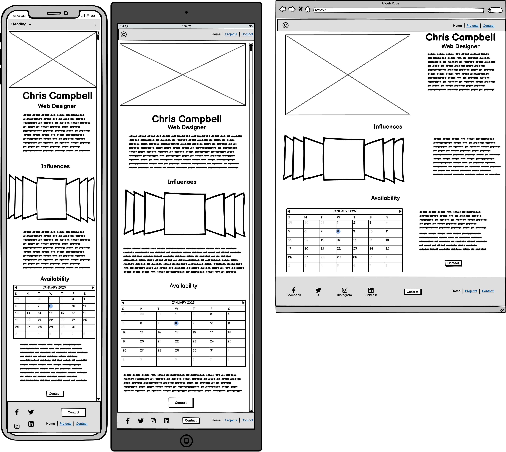
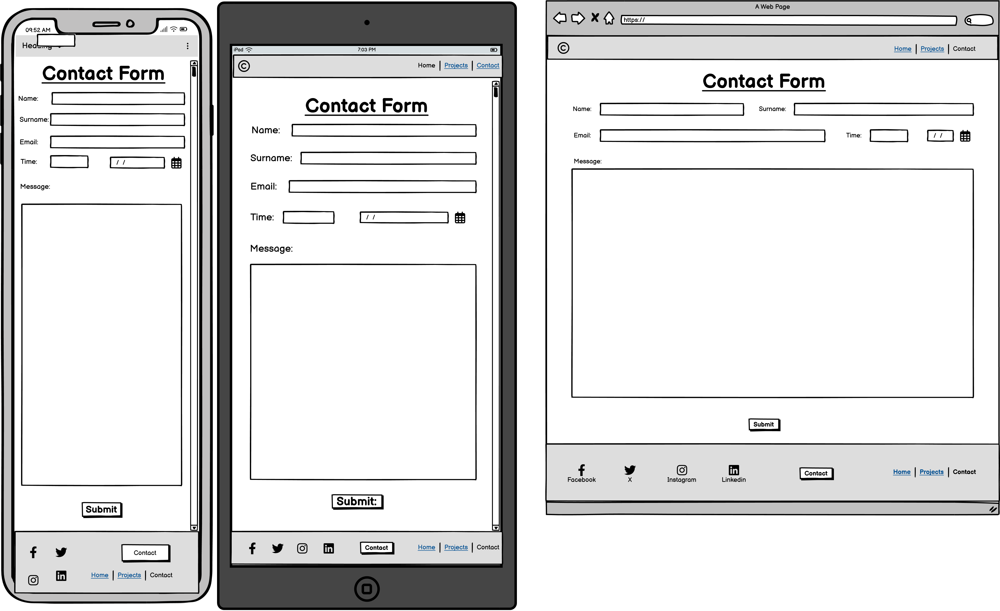
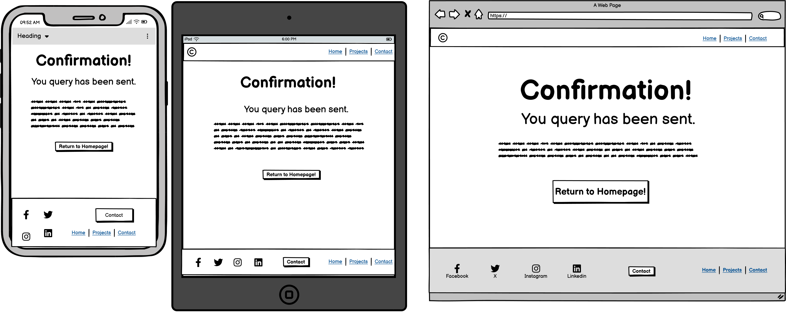

# **1st Milestone Project**
## Build a personal portfolio
The project I have decided to build is a portfolio for myself. As I do not have any projects at this moment on time, I will use random sites which I like for their interactivity and styles to be has placeholders until I can use my own projects to add to the site.
### First Steps
- Went to GitHub projects, and added a new board with 8 items in the todo section with. They have acceptance criteria and tasks in each item. Prioristised each items in order of importance to build the site.
- Next I am starting to work on the wireframe. I have attempted using Balsamiq but we haven't been trained enough on the making a wireframe especially using Balsamiq, so spoke to my mentor and he has advised me to sketch and take an image of the sketch to add it to  my project's Readme file, if I cannot use the Balsamiq to get the desired result, I will sketch the wireframe and take a photo of it to add it.
- Completed wireframes on Balsamiq. I did a wireframe for mobile phone, Tablet, and Laptop/ computer. 
#### Wireframe for Homepage

#### Wireframe for Projects page

#### Wireframe for Contact page

#### Wireframe for Confirmation page

- With the planning phase of the project complete, it is now time to move on to the coding of the site. 

### Coding the website
- I have use the code institute template for this project.
- Added Heroku and mongoDB8.
- Added HTML5's index, confirmation, contact, and project.
- Added Bootstrap5.
- Added a personal favicon's
- Added CSS3.
- Added font awesome6.
- Git committed " added htmls index, contact, confirmation, and project with bootstrap, favicon, css, as well as font awesome."
- Worked on adding items to GitHub project board.
- Git committed " Completed github project board and updated readme file. "
- added wireframes to the images folder.
- Git committed " Added wireframes from Balsamiq. "
- Addded the wireframes to the readme file.
- Git committed " Added wireframes to readme. "
- Added navbar to index.html with personal logo.
- Git committed " Added navbar to index.html with personal logo."